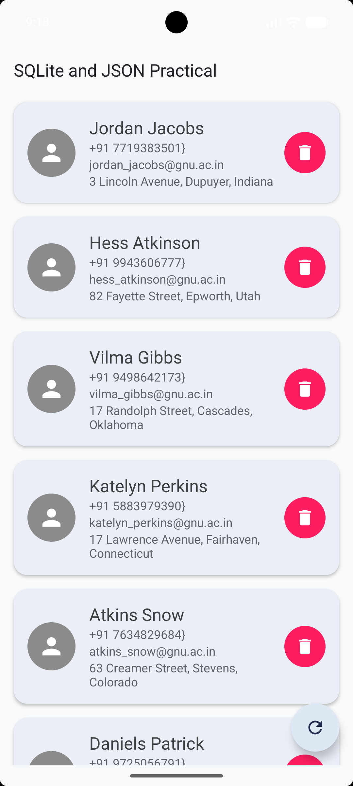
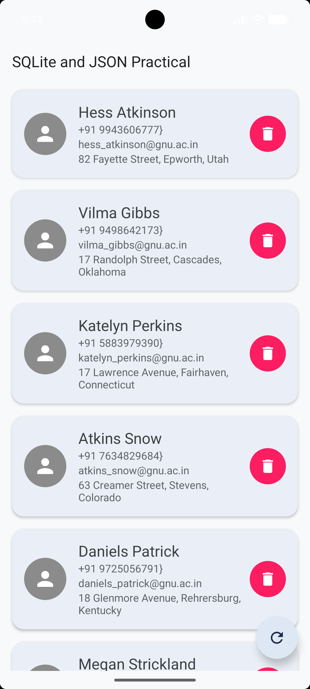

# Practical 7

**Enrollment Number:** 24012011123

## Aim
Develop an Android application that retrieves person data in JSON format from an internet API and stores the retrieved data in an SQLite database.

## Description
This practical involves building an Android application that fetches JSON data from a remote URL over the internet. The app uses `HttpURLConnection` to make network requests on a background thread using Kotlin's `CoroutineScope`. Once the data is retrieved, it is parsed into `Person` objects. These objects are then displayed to the user using a `RecyclerView`. The application also utilizes an SQLite database via `SQLiteOpenHelper` to store the fetched data locally, ensuring offline availability. The `Person` class implements `Serializable` to allow object data to be passed between activities (e.g., passing location data to a Map activity).

## Key Concepts and Technologies
*   **JSON Parsing:** Extracting structured data from web APIs.
*   **Networking:** Making HTTP GET requests using `HttpURLConnection` to fetch data.
*   **Coroutines:** Executing network operations asynchronously using `CoroutineScope(Dispatchers.IO)` to prevent blocking the main UI thread.
*   **RecyclerView:** Efficiently displaying lists of data with a custom adapter (`PersonAdapter`).
*   **SQLite Database:** Persisting data locally using `SQLiteOpenHelper` for offline access (inserting, getting, updating persons).
*   **Serialization:** Passing custom objects (`Person`) between components using `Intent` extras and `Serializable`.
*   **Permissions:** Requesting internet permissions in the manifest to allow external API communication.

## Screenshots

  <!-- Replace 'screenshot1.png' and 'screenshot2.png' with your actual screenshot file names and place them in the root directory alongside this README or update the path to the images -->
  
  &nbsp;&nbsp;&nbsp;&nbsp;&nbsp;
  

